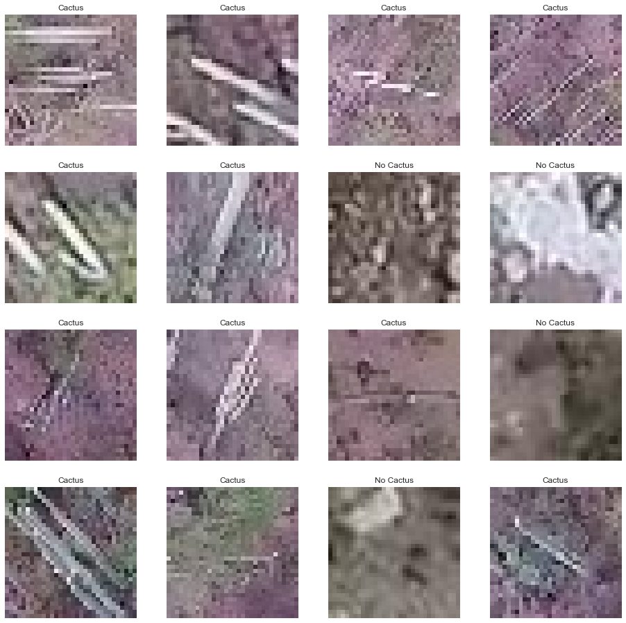

This is a copy of the kernel I submitted to the  competition on Kaggle. I made a small convolutional neural network using the keras Sequential API with a Tensorflow backend. I split the available data into training and validation sets and ensured that the classes were balanced in each set (50% cactus, 50% no cactus). I learned about Keras callbacks by using the ModelCheckpoint, EarlyStopping, and ReduceLROnPlatteau callback functions. My network scored 0.9991/1.0 which put me in the top 50% of participants (613th / 1228). 

You can see my work below!


## Step 1: Examine the data

The first step in any data science project is to get an understanding of what you are working with. In this step I declare my imports and paths to important locations on disk, load some data into memory, and examine it more closely.


```python
import os
import cv2
import numpy as np
import pandas as pd
import matplotlib.pyplot as plt
import seaborn as sns
from keras.preprocessing.image import load_img, img_to_array, ImageDataGenerator
from keras.models import Sequential, load_model
from keras.layers import Conv2D, Dense, Dropout, Flatten, MaxPooling2D
from keras.optimizers import Adam
from keras.callbacks import ModelCheckpoint, ReduceLROnPlateau, EarlyStopping

sns.set()
```

    Using TensorFlow backend.
    


```python
cactus_dir = ""
train_dir = cactus_dir + "train/train/"
test_dir = cactus_dir + "test/test/"

df_train_data = pd.read_csv(cactus_dir + "train.csv")
df_train_data['has_cactus'] = df_train_data['has_cactus'].astype(str)

df_test = pd.read_csv(cactus_dir + "sample_submission.csv")
```

Let's see what the 'train.csv' file has for us


```python
df_train_data.head()
```


<div>
<style scoped>
    .dataframe tbody tr th:only-of-type {
        vertical-align: middle;
    }

    .dataframe tbody tr th {
        vertical-align: top;
    }

    .dataframe thead th {
        text-align: right;
    }
</style>
<table border="1" class="dataframe">
  <thead>
    <tr style="text-align: right;">
      <th></th>
      <th>id</th>
      <th>has_cactus</th>
    </tr>
  </thead>
  <tbody>
    <tr>
      <th>0</th>
      <td>0004be2cfeaba1c0361d39e2b000257b.jpg</td>
      <td>1</td>
    </tr>
    <tr>
      <th>1</th>
      <td>000c8a36845c0208e833c79c1bffedd1.jpg</td>
      <td>1</td>
    </tr>
    <tr>
      <th>2</th>
      <td>000d1e9a533f62e55c289303b072733d.jpg</td>
      <td>1</td>
    </tr>
    <tr>
      <th>3</th>
      <td>0011485b40695e9138e92d0b3fb55128.jpg</td>
      <td>1</td>
    </tr>
    <tr>
      <th>4</th>
      <td>0014d7a11e90b62848904c1418fc8cf2.jpg</td>
      <td>1</td>
    </tr>
  </tbody>
</table>
</div>


We see that each row is a filename ('id') and a class ('has_cactus'). Now let's see how many of each class we have:


```python
print("The number of training images is: {}".format(len(df_train_data)))

df_train_data['has_cactus'].value_counts()
```

    The number of training images is: 17500
    


    1    13136
    0     4364
    Name: has_cactus, dtype: int64


So we have 17500 images total and just 4364 do not have a cactus in them. In other words, 75% of the training data consists of images with a cactus in it. To achieve better-than-random results, we'll have to do better than that. 

Now let's see what some of these images look like:


```python
display, axes = plt.subplots(4, 4, figsize=(16, 16))
imgs = []
labels = []
for i, row in df_train_data.head(16).iterrows():
    fname = os.path.join(train_dir, row['id'])
    imgs.append(load_img(fname))
    labels.append('Cactus' if row['has_cactus'] == '1' else 'No Cactus')

for i, ax in enumerate(axes.reshape(-1)):
    ax.imshow(imgs[i])
    ax.set_title(labels[i])
    ax.axis('off')
plt.show()
```





Looking at a single image it is hard to immediately recognize that there is a cactus present. When we look at the images altogether a pattern is more clear -- long, straight lines seem to be the strongest identifier of a cactus in the images above. A simple convolutional network would probably do well on this data because it will be able to identify those long, straight features.

## Step 2: Prepare the Data for Keras

This is one of the most important steps in the ML process. If your data isn't prepared the right way for your model, then you might as well not have it. Luckily for us, the data has already been collected and formatted quite nicely. The remaining steps for us are to build training and validation sets, create a pipeline to load images into memory, and set up the ImageDataGenerator class from Keras to do some training data augmentation. 

### Training and Validation Sets
We need to create training and validation sets for our model. It is critical that these sets are disjoint -- no shared elements -- so that the validation set can be a true measure of our model's performance as it learns on the training data. 

I decided that my training set should be 50% images with a cactus and 50% images without a cactus so that the model would not initially have a bias towards classifing images as containing a cactus. On the other hand, I wanted my validation set to be 75% images with a cactus and 25% images without a cactus so it would be representative of the data overall.  


```python
has_cactus = df_train_data[df_train_data['has_cactus'] == '1']
not_cactus = df_train_data[df_train_data['has_cactus'] == '0']
```


```python
# Want 80% of not_cactus to make up 50% of the training set
df_train = not_cactus[:3491]
df_train = df_train.append(has_cactus[:3491])
df_train = df_train.sample(frac=1).reset_index(drop=True)

df_train['has_cactus'].value_counts()
```


    0    3491
    1    3491
    Name: has_cactus, dtype: int64


```python
# Want remainder of not_cactus to make up 25% of the validation set
df_valid = not_cactus[3491:]  # Has 873 elements
df_valid = df_valid.append(has_cactus[3491:3491 + 873*3])
df_valid = df_valid.sample(frac=1).reset_index(drop=True)

df_valid['has_cactus'].value_counts()
```


    1    2619
    0     873
    Name: has_cactus, dtype: int64


### Data Augmentation and Pipeline

Now that our training and validation sets have been established we can move on to the next step in the process, which is to create a pipeline to feed training images to our network. This is the part that I was most intimidated by when I first started coding in this competition, but tinkering with this next bit turned out to be one of my favorite parts of the whole thing. Keras makes this pretty straightforward:


```python
# Data augmentation for training data
train_datagen = ImageDataGenerator(rotation_range=50, 
                                   width_shift_range=0.2, 
                                   height_shift_range=0.2, 
                                   horizontal_flip=True, 
                                   rescale=1./255)

# No augmentation for validation data
valid_datagen = ImageDataGenerator(rescale=1./255)
```

Keras also gives you an option to resize your images. I also scaled up the images by a factor of 2 here because that seemed to work better when I was testing.


```python
# Parameters for resizing the image and number of images in a training/validation batch
new_image_size = 64
batch_size = 128

# Data pipeline: filename - dataframe --> image on disk --> keras model

# Training data pipeline
train_generator = train_datagen.flow_from_dataframe(df_train, 
                                                    directory=train_dir, 
                                                    x_col='id', 
                                                    y_col='has_cactus', 
                                                    target_size=(new_image_size, new_image_size), 
                                                    class_mode='binary', 
                                                    batch_size=batch_size)

# Validation: exactly the same except flows from validation dataframe
valid_generator = valid_datagen.flow_from_dataframe(df_valid, 
                                                    directory=train_dir, 
                                                    x_col='id', 
                                                    y_col='has_cactus', 
                                                    target_size=(new_image_size, new_image_size),
                                                    class_mode='binary',
                                                    batch_size=batch_size)
```

    Found 6982 validated image filenames belonging to 2 classes.
    Found 3492 validated image filenames belonging to 2 classes.
    

## Step 3: Building and Training a Convolutional Network

In this part we need to build our model, train it on our training data, and see how it performs. Once again, Keras makes this pretty straightforward.

### Building a Model

We use the Keras Sequential API because this problem does not seem to require complex network architectures that the functional API is capable of providing. A simple CNN with some regularization (Dropout and Maxpooling2D) should do just fine! Here's my network:


```python
model = Sequential()
model.add(Conv2D(32, (3, 3), input_shape=(new_image_size, new_image_size, 3), activation='relu'))
model.add(Dropout(0.2))
model.add(MaxPooling2D((2,2)))
model.add(Conv2D(64, (3, 3), activation='relu'))
model.add(Dropout(0.2))
model.add(MaxPooling2D((2,2)))
model.add(Conv2D(128, (3,3), activation='relu'))
model.add(Dropout(0.2))
model.add(MaxPooling2D((2,2)))
model.add(Conv2D(512, (3,3), activation='relu'))
model.add(Dropout(0.2))
model.add(MaxPooling2D((2,2)))
model.add(Flatten())
model.add(Dense(256, activation='relu'))
model.add(Dropout(0.2))
model.add(Dense(1, activation='sigmoid'))

model.summary()
```

    _________________________________________________________________
    Layer (type)                 Output Shape              Param #   
    =================================================================
    conv2d_1 (Conv2D)            (None, 62, 62, 32)        896       
    _________________________________________________________________
    dropout_1 (Dropout)          (None, 62, 62, 32)        0         
    _________________________________________________________________
    max_pooling2d_1 (MaxPooling2 (None, 31, 31, 32)        0         
    _________________________________________________________________
    conv2d_2 (Conv2D)            (None, 29, 29, 64)        18496     
    _________________________________________________________________
    dropout_2 (Dropout)          (None, 29, 29, 64)        0         
    _________________________________________________________________
    max_pooling2d_2 (MaxPooling2 (None, 14, 14, 64)        0         
    _________________________________________________________________
    conv2d_3 (Conv2D)            (None, 12, 12, 128)       73856     
    _________________________________________________________________
    dropout_3 (Dropout)          (None, 12, 12, 128)       0         
    _________________________________________________________________
    max_pooling2d_3 (MaxPooling2 (None, 6, 6, 128)         0         
    _________________________________________________________________
    conv2d_4 (Conv2D)            (None, 4, 4, 512)         590336    
    _________________________________________________________________
    dropout_4 (Dropout)          (None, 4, 4, 512)         0         
    _________________________________________________________________
    max_pooling2d_4 (MaxPooling2 (None, 2, 2, 512)         0         
    _________________________________________________________________
    flatten_1 (Flatten)          (None, 2048)              0         
    _________________________________________________________________
    dense_1 (Dense)              (None, 256)               524544    
    _________________________________________________________________
    dropout_5 (Dropout)          (None, 256)               0         
    _________________________________________________________________
    dense_2 (Dense)              (None, 1)                 257       
    =================================================================
    Total params: 1,208,385
    Trainable params: 1,208,385
    Non-trainable params: 0
    _________________________________________________________________
    

Now we compile the model using the AdamOptimizer with default settings and Binary Crossentropy as our loss metric. Accuracy is monitored because we need to be able to report how our model does on the training and validation sets. Additionally, we also create several callbacks which will help us during training. 


```python
model.compile(optimizer='adam', 
              loss='binary_crossentropy', 
              metrics=['accuracy'])
```


```python
# Save the model every time its best validation accuracy improves
checkpoint = ModelCheckpoint("model.hdf5", 
                             monitor='val_acc', 
                             verbose=1, 
                             save_best_only=True, 
                             mode='max')

# Reduce the learning rate when the model's performance begins to stagnate 
reduce_lr = ReduceLROnPlateau(monitor='val_acc', 
                              factor=.2,
                              patience=10, 
                              min_lr=1e-9,
                              verbose=1)

# Using early stopping with a high patience value to balance improvement & my own patience
early_stop = EarlyStopping(monitor='val_acc', 
                           patience=100, 
                           verbose=1, 
                           mode='auto', 
                           baseline=None, 
                           restore_best_weights=True)
```

### Training the Model

Now that our model is compiled and we've setup some callbacks to use during training, we can finally train our model. Note that we use model.fit_generator instead of model.fit because we set up our data pipeline with generators. This takes quite a while, so I'm going to load the model that I trained overnight on my own computer instead. 


```python
# hist = model.fit_generator(train_generator, 
#                            steps_per_epoch=len(df_train)//batch_size, 
#                            epochs=1000, 
#                            validation_data=valid_generator, 
#                            validation_steps=len(df_valid)//batch_size, 
#                            callbacks=[checkpoint, reduce_lr, early_stop],
#                            verbose=0)

model = load_model('../input/best-model-1/model.hdf5')
```

Normally, I would plot the model's accuracy as a function of the number of epochs it trained, but we can't do this when we are just loading the model, so this is commented out here.


```python
# def plot_from_history(history):
#     history_dict = history.history
#     loss = history_dict['loss']
#     val_loss = history_dict['val_loss']
#     acc = history_dict['acc']
#     val_acc = history_dict['val_acc']
#     epochs = range(1, len(loss) + 1)
    
#     fig, ax1 = plt.subplots(1, figsize=(8, 4), dpi=150)
#     ax1.set_title('Accuracy vs Epoch')
#     ax1.plot(epochs, acc, label='Training Accuracy')
#     ax1.plot(epochs, val_acc, label='Validation Accuracy')
#     ax1.legend(loc='best')
#     plt.show()

# plot_from_history(hist)
```

We report the model's final validation accuracy so we know what to expect for our results (This can be done when loading the model).


```python
model.evaluate_generator(valid_generator, steps=len(df_valid)//batch_size)
```


    [0.01134091289282811, 0.9973958333333334]


## Making Predictions

Now that the model is trained, we can use it to make predictions on the test data. This will be what we submit to the competition. Our first step is to load the test data into memory, which we can do with the keras.preprocessing.image load_img and img_to_array functions. 


```python
test_fnames = []
test_imgs = []
for fname in os.listdir(test_dir):
    test_fnames.append(fname)
    img = load_img(test_dir + fname, target_size=(new_image_size, new_image_size, 3))
    img = img_to_array(img) / 255
    test_imgs.append(img)
test_imgs = np.array(test_imgs)

test_imgs.shape
```


    (4000, 64, 64, 3)


Now we make the predictions (Note that I do not use the predict_classes function):


```python
pred = model.predict(test_imgs)
pred[:5]
```


    array([[1.2218952e-06],
           [1.0000000e+00],
           [1.0000000e+00],
           [1.0000000e+00],
           [1.0000000e+00]], dtype=float32)


Finally, we save the predictions to the disk. Make sure to set index=False, otherwise you'll end up with an extra column in your csv file that you submit... I learned that the hard way.


```python
submission = pd.DataFrame()
submission['id'] = test_fnames
submission['has_cactus'] = pred
submission.to_csv('submission.csv', index=False)

submission.head()
```


<div>
<style scoped>
    .dataframe tbody tr th:only-of-type {
        vertical-align: middle;
    }

    .dataframe tbody tr th {
        vertical-align: top;
    }

    .dataframe thead th {
        text-align: right;
    }
</style>
<table border="1" class="dataframe">
  <thead>
    <tr style="text-align: right;">
      <th></th>
      <th>id</th>
      <th>has_cactus</th>
    </tr>
  </thead>
  <tbody>
    <tr>
      <th>0</th>
      <td>34d12362206bf3becb77fb0e50ec7a6b.jpg</td>
      <td>0.000001</td>
    </tr>
    <tr>
      <th>1</th>
      <td>b90d27d9ab51c85ebf2b7c3610f9650f.jpg</td>
      <td>1.000000</td>
    </tr>
    <tr>
      <th>2</th>
      <td>1a1ca91fbd12af9c4cd4d1079b8c832c.jpg</td>
      <td>1.000000</td>
    </tr>
    <tr>
      <th>3</th>
      <td>36219f1335a4d56041fa1139a9c27f3f.jpg</td>
      <td>1.000000</td>
    </tr>
    <tr>
      <th>4</th>
      <td>bde96aabc07264b2ca48d7f23dde6964.jpg</td>
      <td>1.000000</td>
    </tr>
  </tbody>
</table>
</div>


